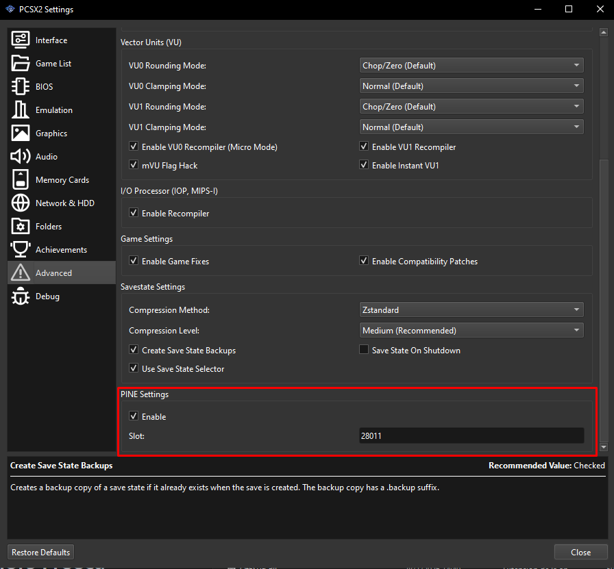
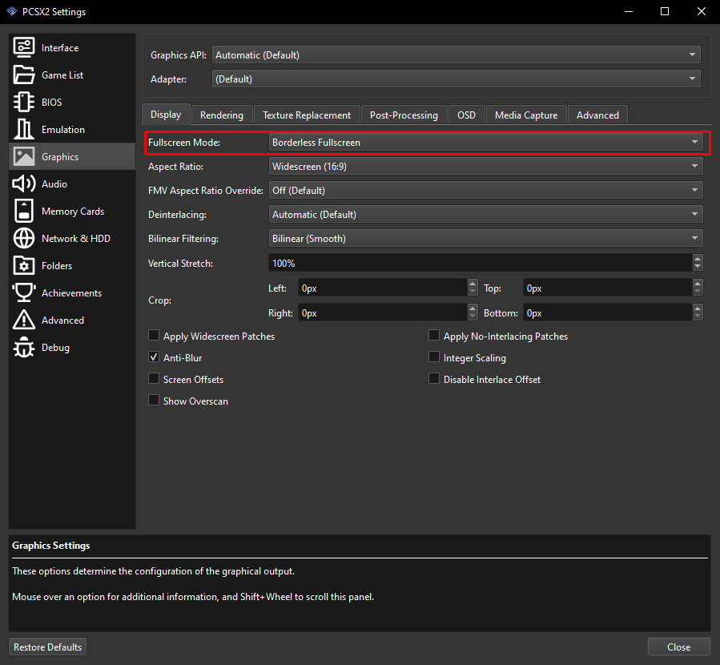
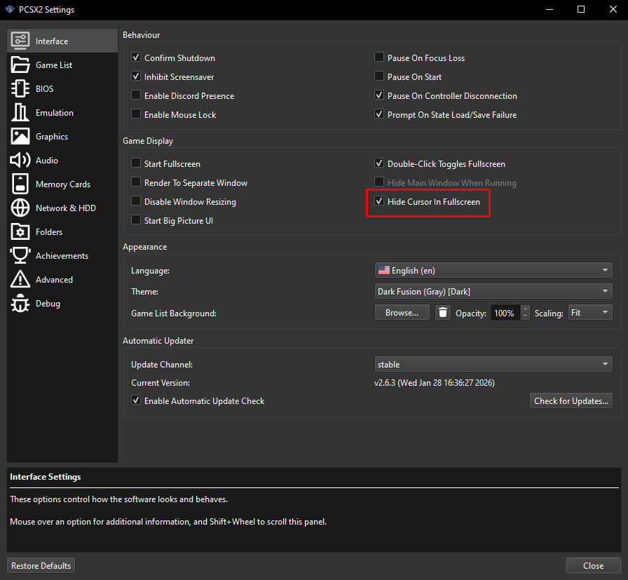

# The Warriors Freecam

Standalone Freecam, coordinate display, player carry, God mode, and reversible
world pause for the USA release of *The Warriors* running in PCSX2. The v0.2.0
build is a portable Windows x64 executable: it does not require Python or a
separately installed .NET runtime.

Every official screenshot keeps this visible in the lower-right corner:

`Freecam mod by mostdak1ng v0.2.0`

The watermark cannot be hidden in the official build, even when the rest of
the HUD is hidden. It identifies the exact version when reporting a bug.

## Requirements

- Windows 10 or Windows 11, x64.
- PCSX2 with its PINE server reachable on the default TCP port `28011`.
- *The Warriors* USA: serial `SLUS-21215`, game version `1.03`, CRC
  `B99A75DE`.
- PCSX2 stable is supported. Nightly support has been verified specifically
  with PCSX2 2.7.522; nightly builds change daily, so later builds may require
  additional testing.
- Borderless fullscreen is the primary tested display mode. Windowed mode is
  supported. Switching between them while the mod is running should work.
- Exclusive fullscreen can run the Freecam but cannot display its external
  HUD or permanent watermark. Use borderless fullscreen or windowed mode.

No administrator rights, Python installation, or external controller library
is required.

## Recommended PCSX2 settings

### Required: enable PINE

In **Settings > Advanced > PINE Settings**, check **Enable** and leave
**Slot** at `28011`, then restart PCSX2. The PINE server is not available to
the mod until PCSX2 has been restarted after enabling it.



### Required for the complete HUD: borderless fullscreen

In **Settings > Graphics > Display**, set **Fullscreen Mode** to **Borderless
Fullscreen**. The Freecam itself can run in exclusive fullscreen, but its
external overlay and permanent version watermark will not be visible.
Windowed mode is also supported.



### Optional: hide the cursor in fullscreen

In **Settings > Interface**, check **Hide Cursor In Fullscreen**. This is not
required, but it greatly improves quality of life when using mouse look.



Other graphics, emulation, and controller settings can remain at the values
that work best for your system and game.

## Critical save-state warning

1. Back up your PCSX2 memory card file before using the mod.
2. Create a backup save state **before** starting the mod.
3. Do not create or load a save state while the mod is running.
4. Exit cleanly with `F10`, or hold `Select+Start` for 1.5 seconds while in
   controller mode and then release both buttons when prompted.

A save state made while the mod is active can contain temporary executable
patches, modified player state, and a modified world timestep. Loading any save
state while active can also replace the memory that the program owns. The
launcher requires explicit confirmation of this warning before it will start.

Use the mod at your own risk. The author is not responsible for damage to a
game save, memory card, or save state.

The program removes its native input hook and restores the player's original
God/no-target bits and the exact original world timestep on a normal exit. It
intentionally does **not** move the player back to its starting position and
does not load a save state automatically. Returning to normal mode stops
overriding the currently active game camera, allowing gameplay, scripted, and
cutscene cameras to resume their own behavior.

## Running

1. Confirm these three PCSX2 settings:
   - **Required:** enable PINE, use slot `28011`, and restart PCSX2 after
     changing the setting.
   - **Required for the overlay:** use **Borderless Fullscreen** or windowed
     mode instead of exclusive fullscreen.
   - **Optional but strongly recommended:** enable **Hide Cursor In
     Fullscreen**.
2. Enter the game with a map loaded, such as the Hangout, a mission, or a
   Rumble map.
3. Create the backup save state.
4. Run `TheWarriorsFreecam.exe`.
5. Wait for the green preflight result, acknowledge the warning, and choose
   **Start Freecam**.
6. Click the game window if keyboard/mouse input is paused because PCSX2 is
   not focused.

The session starts with keyboard/mouse Freecam active, player carry off, world
time normal, HUD visible, and God mode on. By default, Pad 1 continues to
control the game until controller Freecam is selected.

If PCSX2 maps Pad 1 to keyboard keys such as `W`, `A`, `S`, and `D`, enable
**Capture Pad 1 in keyboard/mouse Freecam** in the launcher. Keyboard and mouse
still control the Freecam through Windows, while the game receives a neutral
Pad 1. Normal-camera mode releases Pad 1 automatically. The option is off by
default so a physical controller can continue controlling the game alongside
keyboard/mouse Freecam.

By default, leaving Freecam returns control to whichever camera the game
currently has active. Enable **Return to player FollowCamera when leaving
Freecam** if you specifically want the camera to follow the relocated player
after using carry. This option can override fixed, scripted, or cutscene
cameras, so it is off by default. It also applies when the program closes.

## Keyboard and mouse controls

| Input | Action |
| --- | --- |
| Mouse | Look |
| `W` `A` `S` `D` | Move |
| `Q` / `E` | Move down / up |
| `Shift` | Fast movement (4×) |
| `Ctrl` | Precise movement (0.25×) |
| `V` | Toggle keyboard/mouse Freecam and the normal game camera |
| `P` | Toggle world pause |
| `F8` | Toggle player carry |
| `G` | Toggle God mode |
| `R` | Hide/show the HUD; the version watermark remains visible |
| `F10` | Clean exit |

## Controller controls (Pad 1)

Controller Freecam uses a 10% radial deadzone.

| Input | Action |
| --- | --- |
| `Select+L3` | Enter controller Freecam; press again for normal camera |
| Left stick | Move |
| Right stick | Look |
| `L1` / `R1` | Move down / up |
| `L2` | Fast movement (4×) |
| `R2` | Precise movement (0.25×) |
| `Select+Square` | Toggle world pause |
| `Select+R3` | Toggle player carry |
| `Select+Circle` | Toggle God mode |
| `Select+Triangle` | Hide/show the HUD |
| Hold `Select+Start` for 1.5 seconds, then release both | Clean exit without leaking `Start` to the game |

Entering with `Select+L3` captures Pad 1 so it controls only the Freecam.
Leaving controller mode stops overriding the active game camera and then
returns Pad 1 to the game. Entering with `V` selects keyboard/mouse Freecam and
leaves Pad 1 available to the game.

The native Pad 1 capture has a guest-side timeout. If the host program stops
refreshing it unexpectedly, controller input fails open and returns to the
game automatically in about one second of active gameplay.

## World pause

World pause starts off. Press `P` in keyboard/mouse Freecam, controller
Freecam, or normal-camera mode to toggle it. In controller Freecam,
`Select+Square` provides the same toggle.

Like MapTriggers, this is a practical pause: it reduces the game's native
world timestep to `0.0001` of its current value, or 0.01%. Actors, mission
timers, and world simulation are practically frozen while the Freecam and
overlay continue updating normally.

Disabling world pause restores the exact IEEE-754 timestep bits captured when
it was enabled. It also restores automatically before a loading screen or
world transition and on clean program exit. World pause remains off after the
new map loads.

## Player carry and God mode

Carry starts off. When enabled during either Freecam mode, the player is held
slightly in front of and below the camera. Carry is released in normal-camera
mode and during loading screens; the preference resumes after gameplay returns.

God mode starts on. Toggling it changes only the game's known God bit. On a
normal exit, the exact God/no-target state that the current player entity had
before the mod touched it is restored. This is normally God mode off.

## Overlay

The overlay shows:

- active control mode and status;
- camera X/Y/Z coordinates;
- player X/Y/Z coordinates;
- carry, God mode, world pause, and HUD state;
- current controls; and
- the permanent version watermark.

It tracks the PCSX2 rendering viewport when switching between borderless
fullscreen and windowed mode. It is click-through and hides when the game is
minimized or loses focus.

## Logs and bug reports

Each run creates a JSON-lines log in `logs` beside the executable. If that
location is not writable, it uses:

`%LOCALAPPDATA%\TheWarriorsFreecam\logs`

Use **Open Logs** in the launcher. Attach the newest log and a screenshot when
reporting a bug; the screenshot should include the permanent watermark.

Logs are never uploaded automatically. They deliberately include detailed
diagnostic data such as app and emulator versions, executable and configuration
paths, Windows user/domain and machine names, display/window data, game object
addresses, coordinates, Pad 1 state, world-timestep changes, timings,
transitions, and exception details. Review the file yourself before sharing it
if any of that information is sensitive to you.

## Troubleshooting

- **PINE is not reachable:** enable its PINE server, use port `28011`, restart
  PCSX2, load the game, and choose **Recheck**.
- **Unsupported executable:** use `SLUS-21215` v1.03 with CRC `B99A75DE`.
- **Another hook is active:** close other PINE/native tools, then restart the
  game before using this standalone mod.
- **Windows SmartScreen appears:** v0.2.0 is not code-signed. Verify the SHA-256
  checksum distributed with the release before running it.
- **The overlay is hidden:** restore and focus the PCSX2 game window. If PCSX2
  is using exclusive fullscreen, switch it to borderless fullscreen or
  windowed mode.
- **A save state was loaded accidentally:** exit the mod, close PCSX2 without
  making another save state, restart it, and load the backup created before
  the session.

## Known issues

- Exclusive fullscreen does not support the external overlay or permanent
  version watermark. The Freecam itself still runs; use borderless fullscreen
  or windowed mode for the complete interface.

## Building from source

Install the .NET 8 SDK on Windows x64, then run:

```powershell
powershell -NoProfile -ExecutionPolicy Bypass -File .\scripts\build-release.ps1
```

The script runs the dependency-free test executable, publishes a self-contained
single-file Win64 app, creates the binary and Corresponding Source archives,
and writes SHA-256 checksums under `artifacts`.

The v0.2.0 release build is pinned to .NET runtime 8.0.15 so its included
third-party notices match the runtime payload.

## License

Copyright (C) 2026 mostdak1ng.

The Freecam source is licensed under GNU GPL version 3 only. See `LICENSE`.
Official binary distributions must accompany the complete Corresponding Source,
including the build script and license. The self-contained .NET runtime remains
under its own terms listed in `THIRD-PARTY-NOTICES.txt`.

GPLv3 permits inspection, modification, redistribution, and forks under its
terms. A modified build can therefore change the source-level branding; it
must not be represented as an unmodified official v0.2.0 binary.
